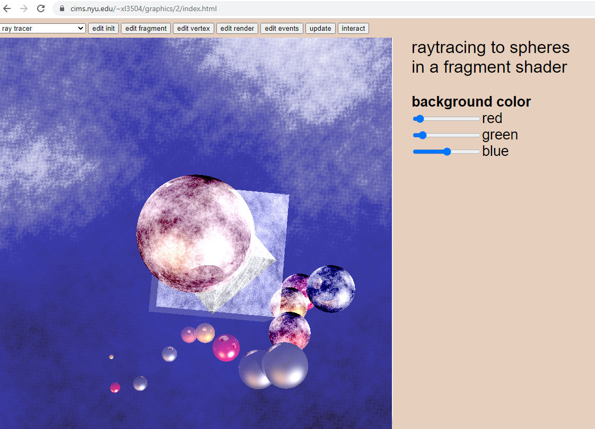
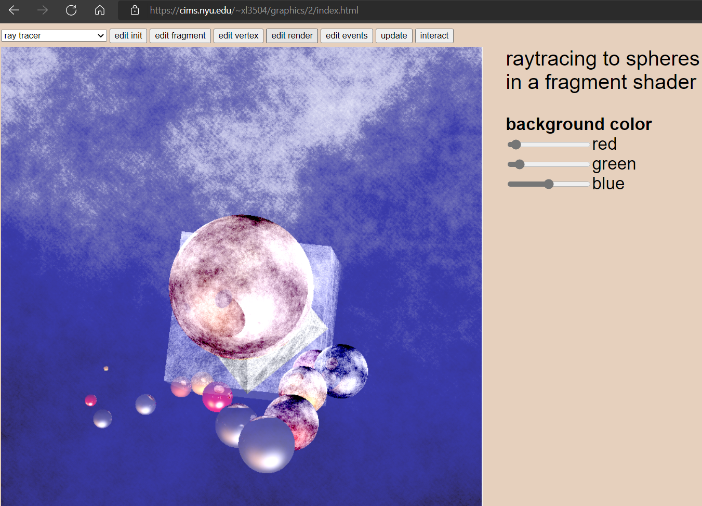
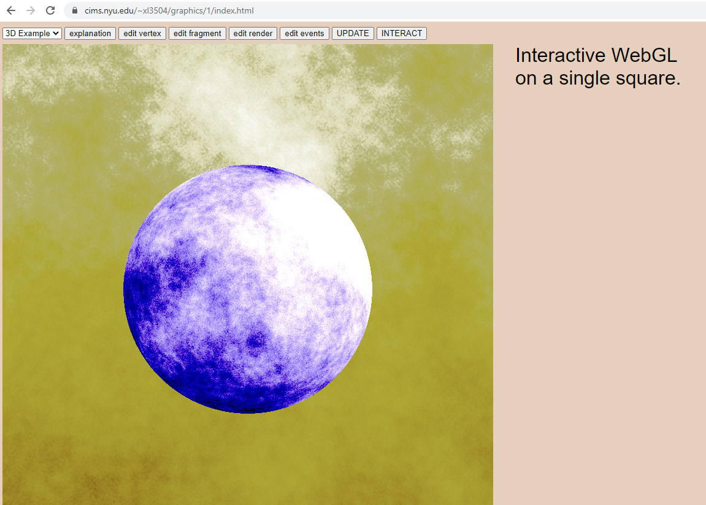
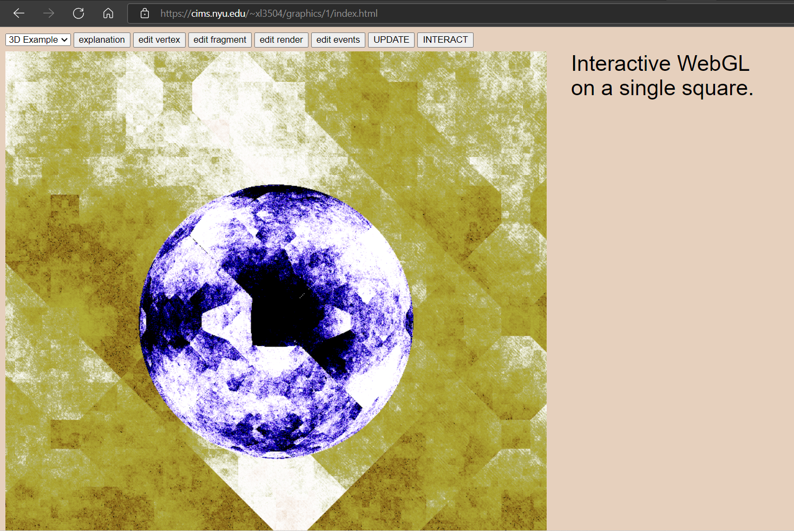
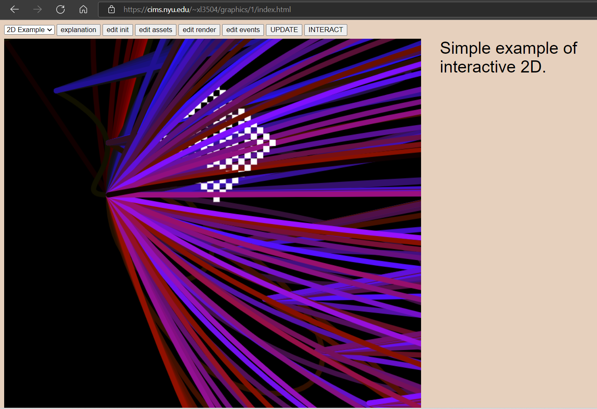

# ray tracing geometry with noise
Xi Liu 
2022 
3d scene is a ray traced sphere by solving ray sphere intersection equation using Lambertian shading and Phong reflection model in GLSL and WebGL 
cube, octahedron, and other convex shapes are traced using intersection of planes, in which planes define halfspaces 
various matrix transformations and computational techniques are used to move the convex shapes and spheres, including translation, scaling, rotation, inverse, and many other numerical procedures that are maintained in a utilities file, matrix operations are mostly done for 4 dimensional, but the same functions are robust enough to calculate up to an arbitrary dimension 
noise is applied in various shapes using Perlin's noise algorithm 
2d scene is manipulation of path tracing and bezier curve in html canvas, different paths and color string are computed for each time t 

