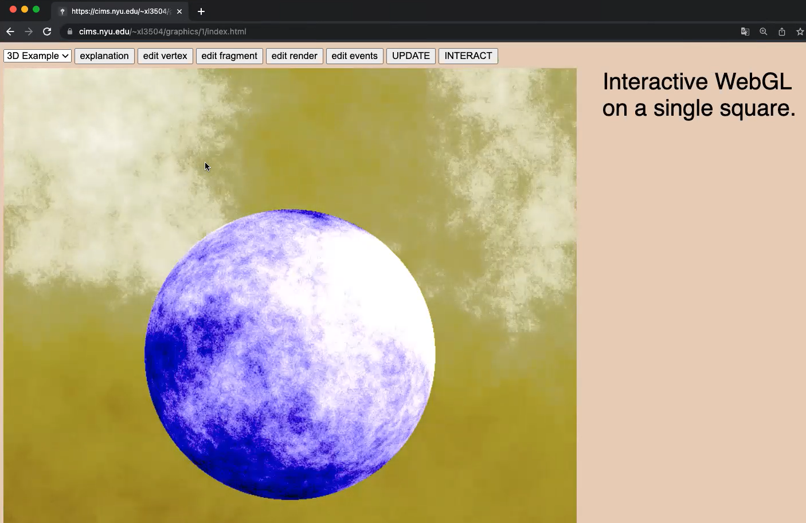

# ray tracing sphere with noise
Xi Liu 2022 
3d scene is a ray traced sphere by solving ray sphere intersection equation using lambertian shading model in GLSL and WebGL 
2d scene is manipulation of path tracing and bezier curve in html canvas  

